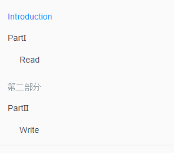
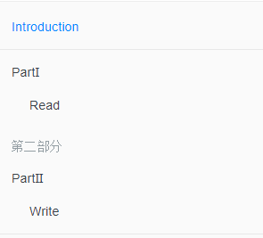

# 基本结构

```
.
├── book.json
├── README.md
├── SUMMARY.md
├── GLOSSARY.md
├── chapter-1/
|   ├── README.md
|   └── something.md
└── chapter-2/
    ├── README.md
    └── something.md
```

# book.json

该文件是 GitBook 的配置文件，比如配置插件等，具体见 [GitBook 配置](./setting.md)。该文件默认不会自动创建，需要进行手动创建。内容结构是 `json` 格式，比如：

```json
{
	"title": "GitBook",
	"author": "MinGRn",
	"version": "3.2.3",
	"language": "zh-hans",
	"plugins": [
	],
	"pluginsConfig": {
	}
}
```

# SUMMARY.md

是书籍的概要信息，也就是左侧的目录结构信息。使用 Markdown 语法，下面是一个简单示例：

```
# Summary

* [Introduction](README.md)
* [PartⅠ](part1/README.md)
  - [Read](part1/read.md)

### 第二部分

* [PartⅡ](part2/README.md)
  - [Write](part2/write.md)
```



可以看到，可以通过 `*`、`-`、`+` 语法定义无序列表的上下级关系，这是 Markdown 语法，不过最多只能定义三级目录。

另外，在 `SUMMARY.md` 中 `#` 和 `###` 是有区别的。前者是注释，后者是定义栏目。

具体文件的内容需要指定对应的文件。如：`[Write](part2/write.md)`。

除此之外，你也可以使用水平线对目录进行分割，如：

```
# Summary

* [Introduction](README.md)

----

* [PartⅠ](part1/README.md)
  - [Read](part1/read.md)

### 第二部分

* [PartⅡ](part2/README.md)
  - [Write](part2/write.md)
```



# GLOSSARY.md

词汇表文件，默认对应的文件是 `GLOSSARY.md`。该文件主要存储词汇信息，如果在其他页面中出现了该文件中的词汇，鼠标放到词汇上会给出词汇示意，可以将鼠
标移到下面两个词汇上看下效果。

Term    AnotherTerm

`GLOSSARY.md` 文件格式如下所示：

```
## Term
Definition for this term

## AnotherTerm
With it's definition, this can contain bold text
and all other kinds of inline markup ...
```