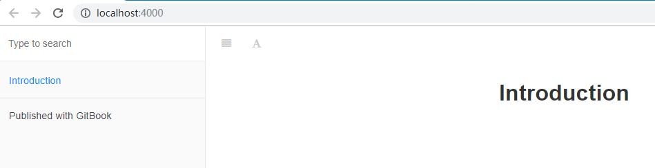

# 前提条件

GitBook 是一个基于 Node.js 的命令行工具，因此。在使用之前你的机器上必须安装 Node.js。关于 Node.js 的安装可以参考 [准备篇]()。

# 安装 GitBook

随意创建一个文件夹，笔者就创建一个 `gitbook` 文件夹，创建成功后进入文件夹：

```
$ mkdir gitbook
$ cd gitbook
```

进入 `gitbook` 文件夹后在命令终端中输入 `gitbook init` 初始化命令。该命令同 `git init`，不过 `git` 是初始化仓库，`gitbook` 则是初始化书。

```
$ gitbook init 

You need to install "gitbook-cli" to have access to the gitbook command anywhere on your system.
If you're installed this package globally, you need to uninstall it.
>> Run "npm uninstall -g gitbook" then "npm install -g gitbook-cli"
```

该命令输出结果提示你：你需要安装 `gitbook-cli` 才能使用 `gitbook` 命令。如果你之前全局安装过 `gitbook` 你需要使用 `uninstall` 命令进行卸
载，然后再重新安装。

另外，有时候可能不会提示这些信息。只是单纯的提示：

```
bash: gitbook: command not found
```

小细节，不必在意。

现在就来进行安装，为了保险起见。还是需要执行一次卸载命令，防止系统中有预留：

```
$ npm uninstall -g gitbook
$ npm uninstall -g gitbook-cli
```

然后再进行安装。需要注意的是，直接使用 `npm` 由于需要从国外进行下载，网速会比较慢。如果带宽不宽裕的童鞋可以使用阿里镜像进行下载。

- npm 直接下载：

```
$ npm install -g gitbook-cli
```

笔者带宽不行，就直接使用阿里镜像下载：

```
$ cnpm install -g gitbook-cli
Downloading gitbook-cli to D:\Npm\nodejs\node_modules\gitbook-cli_tmp
Copying D:\Npm\nodejs\node_modules\gitbook-cli_tmp\_gitbook-cli@2.3.2@gitbook-cli to D:\Npm\nodejs\node_modules\gitbook-cli
Installing gitbook-cli's dependencies to D:\Npm\nodejs\node_modules\gitbook-cli/node_modules
[1/11] commander@2.11.0 installed at node_modules\_commander@2.11.0@commander
[2/11] semver@5.3.0 installed at node_modules\_semver@5.3.0@semver
[3/11] tmp@0.0.31 installed at node_modules\_tmp@0.0.31@tmp
[4/11] bash-color@0.0.4 installed at node_modules\_bash-color@0.0.4@bash-color
[5/11] optimist@0.6.1 installed at node_modules\_optimist@0.6.1@optimist
[6/11] q@1.5.0 installed at node_modules\_q@1.5.0@q
[7/11] user-home@2.0.0 installed at node_modules\_user-home@2.0.0@user-home
[8/11] fs-extra@3.0.1 installed at node_modules\_fs-extra@3.0.1@fs-extra
[9/11] lodash@4.17.4 installed at node_modules\_lodash@4.17.4@lodash
[10/11] npmi@1.0.1 installed at node_modules\_npmi@1.0.1@npmi
[11/11] npm@5.1.0 installed at node_modules\_npm@5.1.0@npm
All packages installed (20 packages installed from npm registry, used 21s(network 21s), speed 373.98kB/s, json 18(113.47kB), tarball 7.55MB)
[gitbook-cli@2.3.2] link D:\Npm\nodejs\gitbook@ -> D:\Npm\nodejs\node_modules\gitbook-cli\bin\gitbook.js
```

到此，就安装成功了。可以在命令终端中输入 `gitbook help` 进行验证：

```
$ gitbook help
    build [book] [output]       build a book
        --log                   Minimum log level to display (Default is info; Values are debug, info, warn, error, disabled)
        --format                Format to build to (Default is website; Values are website, json, ebook)
        --[no-]timing           Print timing debug information (Default is false)

    serve [book] [output]       serve the book as a website for testing
        --port                  Port for server to listen on (Default is 4000)
        --lrport                Port for livereload server to listen on (Default is 35729)
        --[no-]watch            Enable file watcher and live reloading (Default is true)
        --[no-]live             Enable live reloading (Default is true)
        --[no-]open             Enable opening book in browser (Default is false)
        --browser               Specify browser for opening book (Default is )
        --log                   Minimum log level to display (Default is info; Values are debug, info, warn, error, disabled)
        --format                Format to build to (Default is website; Values are website, json, ebook)

    install [book]              install all plugins dependencies
        --log                   Minimum log level to display (Default is info; Values are debug, info, warn, error, disabled)

    parse [book]                parse and print debug information about a book
        --log                   Minimum log level to display (Default is info; Values are debug, info, warn, error, disabled)

    init [book]                 setup and create files for chapters
        --log                   Minimum log level to display (Default is info; Values are debug, info, warn, error, disabled)

    pdf [book] [output]         build a book into an ebook file
        --log                   Minimum log level to display (Default is info; Values are debug, info, warn, error, disabled)

    epub [book] [output]        build a book into an ebook file
        --log                   Minimum log level to display (Default is info; Values are debug, info, warn, error, disabled)

    mobi [book] [output]        build a book into an ebook file
        --log                   Minimum log level to display (Default is info; Values are debug, info, warn, error, disabled)
```

可以看到，在输出的信息中有如何使用说明。比如：

```
// 启动书本
$ gitbook serve

// 指定具体端口进行启动
gitbook serve --lrport=<listen-port> --port=<server-port>
``` 

# 创建书

以上步骤完成后，再次在 `gitbook` 文件夹下执行 `gitbook init` 命令进行初始化书本：

```
$ gitbook init
warn: no summary file in this book
info: create README.md
info: create SUMMARY.md
info: initialization is finished
```

初始化完成，并且可以在文件夹中看到创建了两个文件：

```
$ ls
README.md  SUMMARY.md
```

# 启动

在 `gitbook` 文件夹下执行启动程序命令：

```
$ gitbook serve
Live reload server started on port: 35729
Press CTRL+C to quit ...

info: 7 plugins are installed
info: loading plugin "livereload"... OK
info: loading plugin "highlight"... OK
info: loading plugin "search"... OK
info: loading plugin "lunr"... OK
info: loading plugin "sharing"... OK
info: loading plugin "fontsettings"... OK
info: loading plugin "theme-default"... OK
info: found 1 pages
info: found 0 asset files
info: >> generation finished with success in 1.0s !

Starting server ...
Serving book on http://localhost:4000
```

启动完成后，就可以在浏览器中输入 `http://localhost:4000` 进行预览你的书籍了！

