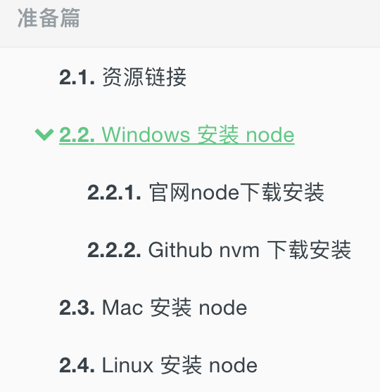

# 前言

GitBook 支持丰富的插件，在旧版本（官网 legacy.gitbook.com）中配置的插件可以在线演示。不过，在新版本的 GitBook （官网 gitbook.com）中不再支持插件。

虽然新版本的 GitBook 不再支持这些插件，但是却不影响我们使用。我们只需要在本地继续使用旧版本（`v3.2.3` 之前）的 GitBook，这些插件依然可以使用。

本篇，只列举经常使用的插件。你也可以点击 [插件官网](https://plugins.gitbook.com/) 查找想要的插件。

> **[success] 小提示**
>
> 所有的插件安装与配置都是在 `gitbook.json` 文件中。当引入新的插件时必须执行 `gitbook install` 命令进行安装该插件，否则不生效。
> `book.json` 插件配置示例如下：
```
{
	"plugins": [
	  // 插件,另外配置插件可以通过 @version 进行指定插件版本。比如：advanced-emoji@^0.2.2
	],
	"pluginsConfig": {
	  // 插件配置
	}
}
```
> 另外，你也可以使用 `-` 指定移除的默认插件，示例：
```
{
	"plugins": [
	  "-lunr"
	]
}
```

# Search Plus

支持中文搜索, 需要将默认的 `search` 和 `lunr` 插件去掉。

[插件地址](https://plugins.gitbook.com/plugin/search-plus)

```json
{
    "plugins": ["-lunr", "-search", "search-plus"]
}
```

# advanced-emoji

支持emoji表情

[emoij表情列表](https://www.webpagefx.com/tools/emoji-cheat-sheet/)

[插件地址](https://plugins.gitbook.com/plugin/advanced-emoji)

```json
{
    "plugins": [
        "advanced-emoji"
    ]
}
```

使用示例：

:smile: :blush: :stuck_out_tongue_closed_eyes:

# Github

添加github图标

[插件地址](https://plugins.gitbook.com/plugin/github)

```json
{
    "plugins": [
        "github"
    ],
    "pluginsConfig": {
        "github": {
            "url": "https://github.com/MinGRn"
        }
    }
}
```

# Github Buttons

添加项目在 github 上的 star，watch，fork情况

[插件地址](https://plugins.gitbook.com/plugin/github-buttons)

```json
{
    "plugins": [
        "github-buttons"
    ],
    "pluginsConfig": {
        "github-buttons": {
            "repo": "MinGRn/GitBook",
            "types": [
                "star",
                "watch",
                "fork"
            ],
            "size": "small"
        }
    }
}
```

# Sharing-plus

分享当前页面，比默认的 sharing 插件多了一些分享方式。

[插件地址](https://plugins.gitbook.com/plugin/sharing-plus)

```
 plugins: ["-sharing", "sharing-plus"]
```

配置:

```json
{
    "pluginsConfig": {
        "sharing": {
           "douban": false,
           "facebook": false,
           "google": true,
           "hatenaBookmark": false,
           "instapaper": false,
           "line": true,
           "linkedin": true,
           "messenger": false,
           "pocket": false,
           "qq": false,
           "qzone": true,
           "stumbleupon": false,
           "twitter": false,
           "viber": false,
           "vk": false,
           "weibo": true,
           "whatsapp": false,
           "all": [
               "facebook", "google", "twitter",
               "weibo", "instapaper", "linkedin",
               "pocket", "stumbleupon"
           ]
       }
    }
}
```

# Tbfed-pagefooter

为页面添加页脚

[插件地址](https://plugins.gitbook.com/plugin/tbfed-pagefooter)

```json
{
    "plugins": [
       "tbfed-pagefooter"
    ],
    "pluginsConfig": {
        "tbfed-pagefooter": {
            "copyright":"Copyright &copy MinGRn 2018",
            "modify_label": "该文件修订时间：",
            "modify_format": "YYYY-MM-DD HH:mm:ss"
        }
    }
}
```

# Favicon

更改网站的 favicon.ico

[插件地址](https://plugins.gitbook.com/plugin/favicon)

```json
{
    "plugins": [
        "favicon"
    ],
    "pluginsConfig": {
        "favicon": {
            "shortcut": "assets/images/favicon.ico",
            "bookmark": "assets/images/favicon.ico",
            "appleTouch": "assets/images/apple-touch-icon.png",
            "appleTouchMore": {
                "120x120": "assets/images/apple-touch-icon-120x120.png",
                "180x180": "assets/images/apple-touch-icon-180x180.png"
            }
        }
    }
}
```

# Alerts

添加不同 alerts 样式的 blockquotes，目前包含 info, warning, danger 和 success 四种样式。

[插件地址](https://plugins.gitbook.com/plugin/alerts)

```json
{
    "plugins": ["alerts"]
}
```

下面是使用示例：

```
Info styling
> **[info] For info**
>
> Use this for infomation messages.

Warning styling
> **[warning] For warning**
>
> Use this for warning messages.

Danger styling
> **[danger] For danger**
>
> Use this for danger messages.

Success styling
> **[success] For info**
>
> Use this for success messages.
```

效果如下所示：

Info styling
> **[info] For info**
>
> Use this for infomation messages.

Warning styling
> **[warning] For warning**
>
> Use this for warning messages.

Danger styling
> **[danger] For danger**
>
> Use this for danger messages.

Success styling
> **[success] For info**
>
> Use this for success messages.

# Sectionx

将页面分块显示，标签的 tag 最好是使用 b 标签，如果使用 h1-h6 可能会和其他插件冲突。  

[插件地址](https://plugins.gitbook.com/plugin/sectionx)  

```json
{
    "plugins": [
       "sectionx"
   ],
    "pluginsConfig": {
        "sectionx": {
          "tag": "b"
        }
      }
}
```
使用示例

```
<!--sec data-title="Sectionx Demo" data-id="section0" data-show=true ces-->

Insert markdown content here (you should start with h3 if you use heading).  

<!--endsec-->
```

<!--sec data-title="Sectionx Demo" data-id="section0" data-show=true ces-->

Insert markdown content here (you should start with h3 if you use heading).  

<!--endsec-->

# Chart

使用 C3.js 或者 Highcharts 绘制图形。

[插件地址](https://plugins.gitbook.com/plugin/chart)  

[C3.js GitHub](https://github.com/c3js/c3)  

[highcharts GitHub](https://github.com/highcharts/highcharts)

```json
{
  "plugins": ["chart"],
  "pluginsConfig": {
      "chart": {
          "type": "highcharts"
      }
  }
}
```

[Highcharts 官网](https://www.highcharts.com/) 示例：

**注意：** 不能为图表指定 `renderTo` 属性

```

{
    "chart": {
        "type": "spline"
    },
    "title": {
        "text": "Monthly Average Temperature"
    },
    "subtitle": {
        "text": "Source: WorldClimate.com"
    },
    "xAxis": {
        "categories": ["Jan", "Feb", "Mar", "Apr", "May", "Jun","Jul", "Aug", "Sep", "Oct", "Nov", "Dec"]
    },
    "yAxis": {
        "title": {
            "text": "Temperature"
        },
        "labels": {
            "format": "{value}°"
        }
    },
    "tooltip": {
        "crosshairs": true,
        "shared": true
    },
    "plotOptions": {
        "spline": {
            "marker": {
                "radius": 4,
                "lineColor": "#666666",
                "lineWidth": 1
            }
        }
    },
    "series": [{
        "name": "Tokyo",
        "marker": {
            "symbol": "square"
        },
        "data": [7.0, 6.9, 9.5, 14.5, 18.2, 21.5, 25.2, {
            "y": 26.5,
            "marker": {
                "symbol": "url(https://www.highcharts.com/samples/graphics/sun.png)"
            }
        }, 23.3, 18.3, 13.9, 9.6]
    }, {
        "name": "London",
        "marker": {
            "symbol": "diamond"
        },
        "data": [{
            "y": 3.9,
            "marker": {
                "symbol": "url(https://www.highcharts.com/samples/graphics/snow.png)"
            }
        }, 4.2, 5.7, 8.5, 11.9, 15.2, 17.0, 16.6, 14.2, 10.3, 6.6, 4.8]
    }]
}

```


{
    "chart": {
        "type": "spline"
    },
    "title": {
        "text": "Monthly Average Temperature"
    },
    "subtitle": {
        "text": "Source: WorldClimate.com"
    },
    "xAxis": {
        "categories": ["Jan", "Feb", "Mar", "Apr", "May", "Jun","Jul", "Aug", "Sep", "Oct", "Nov", "Dec"]
    },
    "yAxis": {
        "title": {
            "text": "Temperature"
        },
        "labels": {
            "format": "{value}°"
        }
    },
    "tooltip": {
        "crosshairs": true,
        "shared": true
    },
    "plotOptions": {
        "spline": {
            "marker": {
                "radius": 4,
                "lineColor": "#666666",
                "lineWidth": 1
            }
        }
    },
    "series": [{
        "name": "Tokyo",
        "marker": {
            "symbol": "square"
        },
        "data": [7.0, 6.9, 9.5, 14.5, 18.2, 21.5, 25.2, {
            "y": 26.5,
            "marker": {
                "symbol": "url(https://www.highcharts.com/samples/graphics/sun.png)"
            }
        }, 23.3, 18.3, 13.9, 9.6]
    }, {
        "name": "London",
        "marker": {
            "symbol": "diamond"
        },
        "data": [{
            "y": 3.9,
            "marker": {
                "symbol": "url(https://www.highcharts.com/samples/graphics/snow.png)"
            }
        }, 4.2, 5.7, 8.5, 11.9, 15.2, 17.0, 16.6, 14.2, 10.3, 6.6, 4.8]
    }]
}


# local-video

使用 Video.js 播放视频

[插件地址](https://plugins.gitbook.com/plugin/local-video)

```json
{
    "plugins": ["local-video"]
}
```

使用示例：为了使视频可以自适应，我们指定视频的 `width` 为100%，并设置宽高比为16:9，如下面所示:

```

  <video id="my-video" class="video-js" controls preload="auto" width="100%" poster=".(**).jpg" data-setup='{"aspectRatio":"16:9"}'>
  <source src=".(**).mp4" type='video/mp4'>
  <source src=".(**).flv" type='video/flv'>
  <p class="vjs-no-js">
    To view this video please enable JavaScript, and consider upgrading to a web browser that
    <a href="http://videojs.com/html5-video-support/" target="_blank">supports HTML5 video</a>
  </p>
  </video>

```

另外我们还要再配置下css，即在website.css中加入

```css
.video-js {
    width:100%;
    height: 100%;
}
```


  <video id="my-video" class="video-js" controls preload="auto" poster="./_images/video_cover.jpg" data-setup='{"aspectRatio":"16:9"}'>
  <source src="./_videos/【国漫古风虐向】下一世，不知可否再相见.mp4" type='video/mp4'>
  <source src="./_videos/【国漫古风虐向】下一世，不知可否再相见.flv" type='video/flv'>
  <p class="vjs-no-js">
    To view this video please enable JavaScript, and consider upgrading to a web browser that
    <a href="http://videojs.com/html5-video-support/" target="_blank">supports HTML5 video</a>
  </p>
  </video>



- 视频原创：[菌子笑笑](https://space.bilibili.com/12504858)


# emphasize

为文字加上底色

[插件地址](https://plugins.gitbook.com/plugin/emphasize)

```json
{
    "plugins": ["emphasize"]
}
```

使用示例：

```
This text is highlighted !

This text is highlighted with **markdown**!

This text is highlighted in green!

This text is highlighted in red!

This text is highlighted with a custom color!
```

This text is highlighted !

This text is highlighted with **markdown**!

This text is highlighted in green!

This text is highlighted in red!

This text is highlighted with a custom color!

# expandable-chapters

使左侧目录可折叠

[插件地址](https://plugins.gitbook.com/plugin/expandable-menu)

```json
{
    "plugins": ["expandable-chapters"]
}
```

使用示例：


