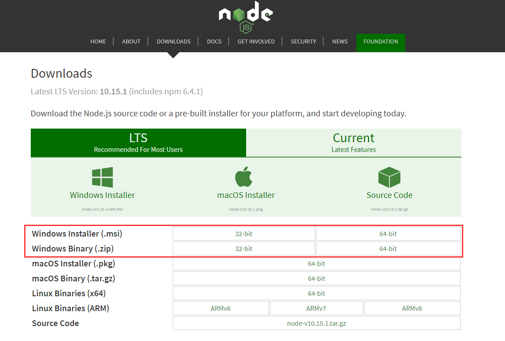
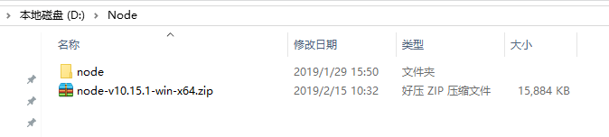
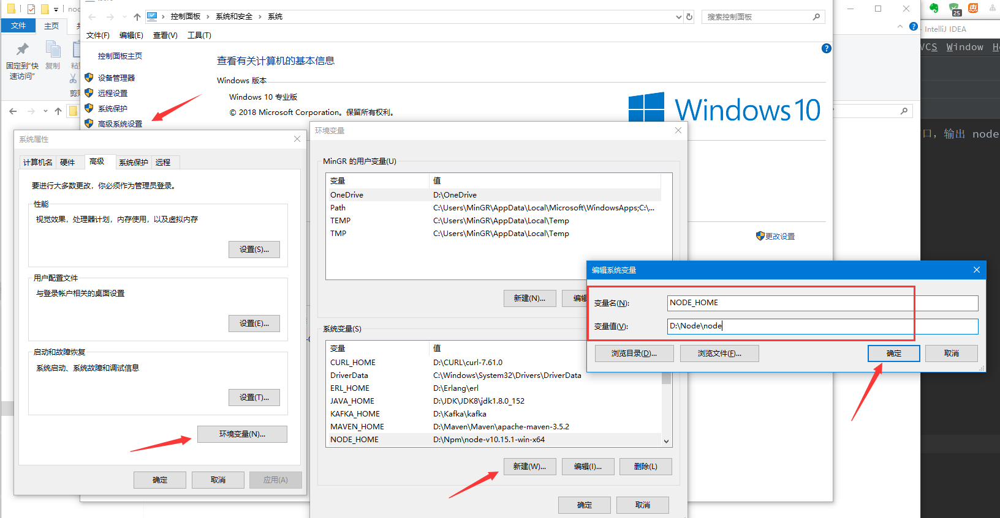
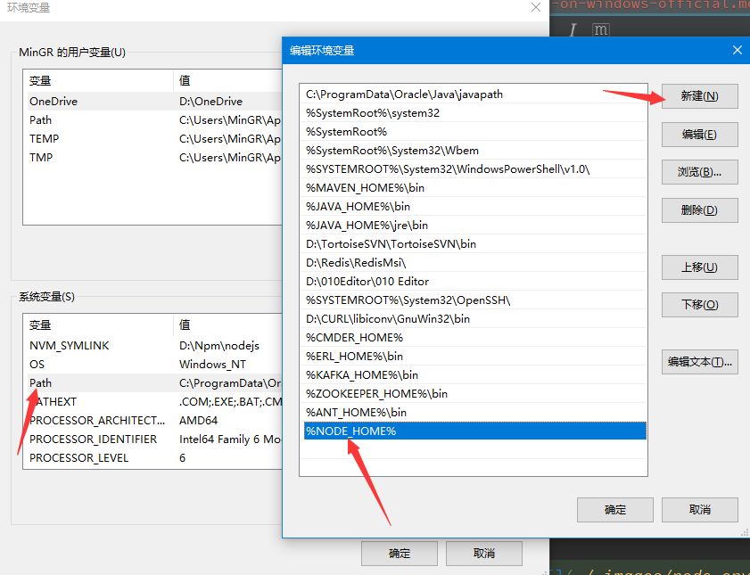

# 前言

在官网下载的 `node` 安装起来特别简单，对新手而言也是建议使用的安装方式。

- 官网 node 下载地址：https://nodejs.org/en/download/



官网 windows 系统 node 类型分为两种，分别是安装版本（`.mis`）和解压版本（`.zip`）。安装版本直接下载后安装即可，解压版本则需要自己配置环境变量
等步骤。虽然，相对于安装版本较麻烦些，不过这是推荐使用的安装方式。因为解压版本更有利于版本升级、降级等操作！

**因此，建议所有的 node 使用者都使用解压版本。**

> **[info] 小提示**
>
> 官网 node 版本分为 LTS 和 Current 版本。LTS 是长期支持版本，而 Current 是开发版本，类似于版本的 Snapshot 版本，
> 通常而言建议使用 LTS 版本。不过，如果你想体验 node 的最新特性则推荐你使用 Current 版本。建议新手使用 LTS 版本。

# 下载

笔者的操作系统是 64位，因此这里下载的是 64位解压版本。如果你是32位操作系统，则需要下载32位解压版本。

笔者压缩文件保存在 `D:\NODE` 目录中，解压后文件夹重命名为 `node`：



node 文件夹中的文件如下所示：

```
D:\NODE\node       
├─node_modules    
├─CHANGELOG.md  
├─LICENSE
├─node.exe
├─node_etw_provider.man
├─node_perfctr_provider.man
├─nodevars.bat
├─npm
├─npm.cmd
├─npx
├─npx.cmd
└─README.md   
```

到此，基本上已经完成了。你可以在 node 文件夹下打开 CMD 命令窗口，输出 node 版本信息，如下所示：

```
$ pwd
D:\Node\node

$ node -v
v10.15.1

$ npm -v
6.4.1
```

不过，为了能够在全局环境下使用，你还需要配置系统的环境变量。

# 环境变量配置

在计算机环境变量（右键单击 `我的电脑` - `属性` - `高级系统设置` - `高级` - `环境变量`）中的系统变量栏 `新建` 环境变量。变量名为 `NODE_HOME`，变量值为 `node` 文件所在目录，即 `D:\NODE\node`:

```
NODE_HOME: D:\NODE\node
```



**小提示：** 如果看不清，你可以在 `图片上鼠标右键 -> 在新窗口中打开图片` 进行高清预览。

保存后，还是在系统变量中找到 `Path` 变量，双击进行编辑，在变量中新建变量，输入 `%NODE_HOME%`：



现在，你就可以直接在任意目录下打开 CMD 命令终端，输入 `npm -v` 和 `node -v` 进行验证是否安装成功。

如果，输出失败。可能的原因是系统没有应用环境变量，需要进行关机重启再次验证。

# 使用 cnpm

通常，我们都是使用 npm 进行下载安装依赖。比如安装 `gitbook`：

```
$ npm install -g gitbook-cli
```

正常而言，是没问题的。不过，直接使用 npm 进行下载是需要从国外的网络中进行下载，对于带宽不宽裕的用户来说可能需要等待许久才能下载完成。甚至有时，由
于网络波动而下载失败，导致后续都无法继续下载。

为此，阿里构建了一个专属的国内镜像。镜像的同步频率目前为 10分钟 一次以保证尽量与官方服务同步。想要使用阿里镜像只需要一步操作。

直接在命令行中输入如下命令即可：

```
$ npm install -g cnpm --registry=https://registry.npm.taobao.org
```

示例如下（由于是从国外下载，所以网络会存在波动。下载安装的比较慢，请耐心等到）：

```
$ npm install -g cnpm --registry=https://registry.npm.taobao.org
npm WARN deprecated socks@1.1.10: If using 2.x branch, please upgrade to at least 2.1.6 to avoid a serious bug with socket data flow and an import issue introduced in 2.1.0
D:\Node\node\cnpm -> D:\Node\node\node_modules\cnpm\bin\cnpm
+ cnpm@6.0.0
added 679 packages from 889 contributors in 112.899s
```

阿里镜像使用的命令是 `cnpm`，下载安装完成后你就能在 `D:\Node\node\node_modules` node模块管理文件夹下看到多了一个 `cnpm` 文件夹，该文件夹
下包含了 `cnpm` 相关操作文件。

```
D:\NODE\node_modules       
├─npm 
└─cnpm
```

`cnpm` 与 `npm` 用法相同，由于使用国内镜像，因此网络更快！现在你就可以直接使用 `cnpm` 命令进行管理与下载相关依赖了！

<!--sec data-title="扩展" data-id="section0" data-show=true ces-->

事实上，直接使用如下命令是需要下载 `cnpm` 的。

```
$ npm install -g cnpm --registry=https://registry.npm.taobao.org
```

命令执行完成后可以在 `node` 的安装目录下的 `node_modules` 看到 `cnpm` 文件夹，该文件夹下就是 `cnpm` 相关命令：

```
$ ls
cnpm    npm
```

因此，直接使用这种方式依然需要从外网进行下载 `cnpm` 依赖。虽然安装包不大，但是也需要宽裕的带宽。除了直接使用这种方式之外，还有另外一种方式进行设
置下载镜像。

使用 `npm config list` 命令可以查看 `npm` 的配置信息：

```
$ npm config list
...
metrics-registry = "https://registry.npmjs.org/"
...
```

可以看到 `metrics-registry` 指定了仓库的下载地址。虽然平常使用 `cnpm` 来代替 `npm`，但也只是使用新的指令而已。有时候安装依赖时使用的源还是
`https://registry.npmjs.org/`。所以，直接修改 `metrics-registry` 也是就能从根源上解决问题。这样 `cnpm` 和 `npm` 就没有任何差别了。

```
$ npm config set registry https://registry.npm.taobao.org
$ npm config list
...
metrics-registry = "https://registry.npm.taobao.org"
...
```

注意，这种方式是不推荐的方式，建议平时使用的时候还是直接使用 `cnpm` 较好！

<!--endsec-->

# node 升级

之前说过，使用解压版本更便于维护升级。相反，使用安装版本你可能还需要清理下相关文件。

想要升级你的 node 版本，只需要在官网上下载你想要的版本，进行解压。解压完成后只需要修改在 [环境变量配置](#环境变量配置) 中说的 `NODE_HOME` 的
值即可。该值指向新的 node 所在文件夹，`Path` 不需要做任何修改。

这样就完成了 node 升级，是不是很简单 :stuck_out_tongue: :stuck_out_tongue: :stuck_out_tongue: :stuck_out_tongue:

# node 卸载

有时候，可能觉得 node 在系统中使用的不是太好，想要将其卸载掉。那你只需要将环境变量中的 `NODE_HOME` 和 `Path` 配置的环境变量删除即可。另外再将
node 所在文件夹删掉。

如果你不知道 `node` 和 `npm` 文件夹的位置，你可以在 CMD 命令终端使用 `where` 指令进行快速查找，示例如下：

```
$ where npm
D:\Node\node\npm
D:\Node\node\npm.cmd

$ where node
D:\Node\node\node.exe
```

这样就删除了相关文件。

所以，node 安装起来是不是特别简单 :smile: :smile: :smile: :smile: